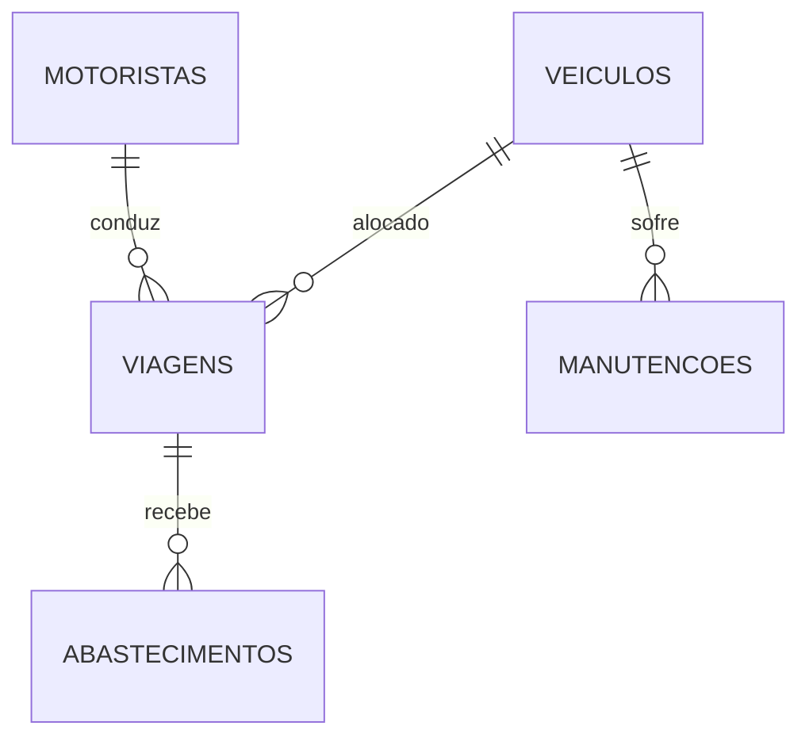

# 🚚 LOGIXFLOW

Sistema profissional e inteligente de gestão e monitoramento de frotas operacionais em tempo real.

---

# 📋 Visão Geral

O **LOGIXFLOW** é uma plataforma robusta desenvolvida para centralizar, monitorar e otimizar operações logísticas de frotas comerciais.

O sistema integra informações financeiras e operacionais em tempo real, oferecendo sincronização instantânea entre usuários através do Supabase Realtime.

Seu objetivo é reduzir erros operacionais, melhorar a disponibilidade dos ativos e fornecer indicadores estratégicos para tomada de decisão.

---

# ✨ Recursos

* Atualização em tempo real sem necessidade de refresh
* Dashboard executivo com indicadores financeiros
* Controle de veículos da frota
* Gestão de motoristas
* Controle completo de viagens
* Histórico de manutenções
* Controle de abastecimentos
* Interface responsiva
* Dark Mode
* Regras inteligentes de validação operacional
* Tipagem forte com TypeScript
* Integração com Supabase Realtime

---

# 📦 Módulos do Sistema

## 📊 Dashboard Executivo

Indicadores financeiros e operacionais em tempo real:

* Custo Total
* Média de custo por veículo
* Quantidade de viagens
* Veículos disponíveis
* Estatísticas da operação

---

## 🚛 Frota (Veículos)

Cadastro e gerenciamento dos ativos da empresa.

Funcionalidades:

* Cadastro de veículos
* Controle de disponibilidade
* Identificação dos veículos em uso
* Histórico operacional

---

## 👨‍✈️ Motoristas

Gestão completa da equipe.

Funcionalidades:

* Cadastro de motoristas
* Controle de disponibilidade
* Vinculação às viagens

---

## 🛣️ Viagens

Controle operacional das rotas.

Funcionalidades:

* Origem e destino
* Veículo utilizado
* Motorista responsável
* Data de saída e retorno
* Status da viagem
* Quilometragem inicial e final

---

## 🔧 Manutenções

Controle técnico dos veículos.

Funcionalidades:

* Registro de oficinas
* Histórico de serviços
* Custos de manutenção
* Situação da manutenção

---

## ⛽ Abastecimentos

Controle financeiro de combustível.

Funcionalidades:

* Litros abastecidos
* Valor por litro
* Custo total
* Local do abastecimento
* Vinculação com a viagem

---

# ⚙️ Regras de Negócio Inteligentes

O sistema possui mecanismos de validação cruzada para evitar erros operacionais.

## 🚫 Bloqueio de Veículo em Uso

Um veículo em viagem ativa não pode ser utilizado em outra viagem simultaneamente.

---

## 🔧 Bloqueio de Veículo em Manutenção

Veículos com manutenção em andamento são automaticamente marcados como indisponíveis.

---

## 👨‍✈️ Bloqueio de Motorista

Motoristas em viagem ativa não aparecem na lista de disponíveis para novas rotas.

---

## 🔄 Atualização em Tempo Real

Todas as alterações são sincronizadas instantaneamente entre os usuários conectados.

---

# 🚀 Tecnologias Utilizadas

## Frontend

* Next.js 15
* TypeScript
* Tailwind CSS
* Lucide React

## Backend

* Supabase
* PostgreSQL

## Realtime

* Supabase Realtime
* WebSockets

---

# 🗄️ Arquitetura do Banco de Dados



---

# 📁 Estrutura do Projeto

```text
logixflow/
│
├── app/                # Rotas e páginas do Next.js
├── components/         # Componentes reutilizáveis
├── lib/                # Clientes e configurações
├── services/           # Serviços e comunicação com banco
├── types/              # Interfaces TypeScript
├── public/             # Logos e imagens
├── .env.local
├── package.json
└── README.md
```

---

# 📸 Capturas de Tela

## Dashboard


# 🛠️ Instalação

## Pré-requisitos

* Node.js 18+
* Conta no Supabase
* Git

---

## Clonar o repositório

```bash
git clone https://github.com/awaldige/logixflow.git

cd logixflow
```

---

## Instalar dependências

```bash
npm install
```

---

## Configurar variáveis de ambiente

Crie um arquivo:

```text
.env.local
```

E adicione:

```env
NEXT_PUBLIC_SUPABASE_URL=SUA_URL_DO_SUPABASE

NEXT_PUBLIC_SUPABASE_ANON_KEY=SUA_CHAVE_ANON_DO_SUPABASE
```

---

## Executar em desenvolvimento

```bash
npm run dev
```

Abra:

```text
http://localhost:3000
```

---

## Build de produção

```bash
npm run build

npm run start
```

---

# 🔄 Realtime

As tabelas principais utilizam Supabase Realtime:

* veículos
* motoristas
* viagens
* manutenções
* abastecimentos

Garantindo sincronização automática entre usuários conectados.

---

# 🚀 Roadmap

## Implementado

* [x] Dashboard
* [x] Veículos
* [x] Motoristas
* [x] Viagens
* [x] Manutenções
* [x] Abastecimentos
* [x] Atualização em tempo real

---

## Próximas Funcionalidades

* [ ] Relatórios em PDF
* [ ] Exportação para Excel
* [ ] Dashboard avançado com gráficos
* [ ] Controle de pneus
* [ ] Upload de documentos dos veículos
* [ ] Alertas automáticos de manutenção
* [ ] Controle de vencimento de CNH
* [ ] Controle de licenciamento
* [ ] Controle de IPVA
* [ ] Autenticação com múltiplos usuários
* [ ] Perfis de acesso

---

# 👨‍💻 Autor

### André Waldige

Desenvolvedor Principal

GitHub:

https://github.com/awaldige

---

# 📄 Licença

Projeto de uso privado.

Todos os direitos reservados.
